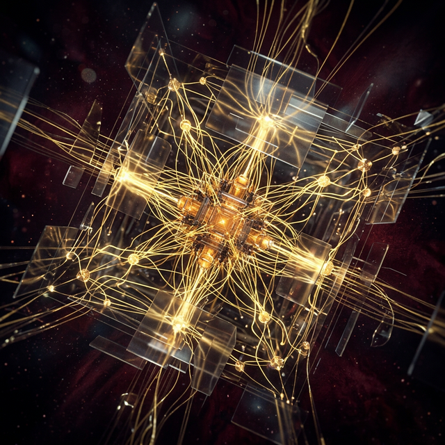
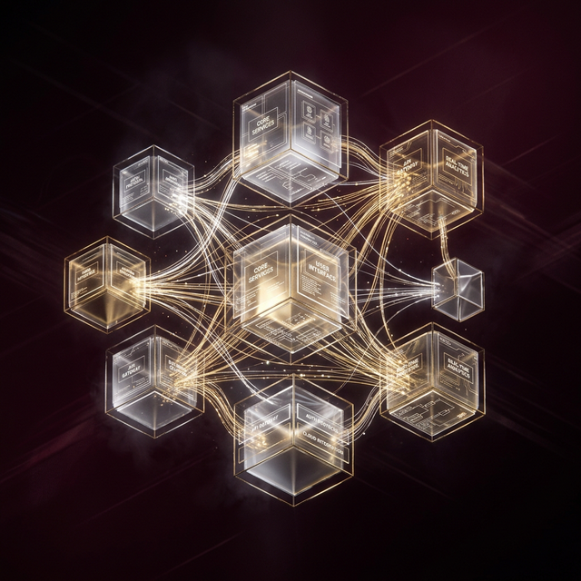
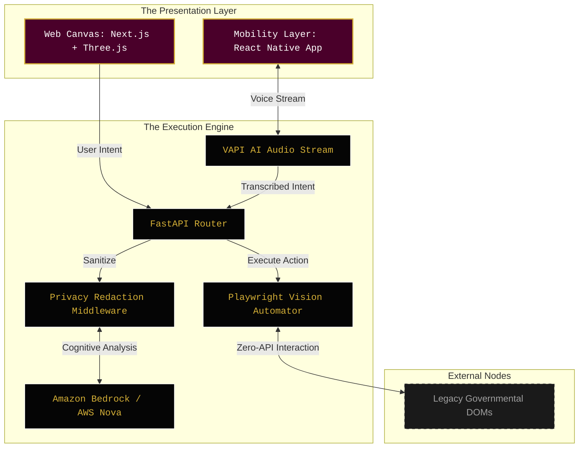

<div align="center">
  
</div>

<br />

<div align="center">

# ✦ B H A R A T &nbsp;&nbsp; M A T R I X A I ✦
**The First Agentic Interface for India.**

[](#)
[](#)
[](#)
[](#)
[](#)
[](#)

A proprietary, high-performance Cognitive Visual Engine navigating Indian digital infrastructure autonomously. Built for the citizens. Confidential Framework.

</div>

<br />

## ✦ The Architecture Matrix

Bharat MatrixAI is a hyper-realistic, high-performance ecosystem divided into three core operational layers. It possesses a cinematic WebGL frontend, a React Native voice-first mobile interface, and a heavy-duty Python Execution Layer for vision-based browser automation.

<div align="center">
  
</div>

### System Flow


<br />

## ✦ Layer Diagnostics

<table width="100%">
  <tr>
    <td width="33%" valign="top">
      <h3>I. The Web Canvas</h3>
      <p>A god-level, award-winning cinematic Next.js 16 web experience.</p>
      <ul>
        <li><b>Engine:</b> Next.js, React, TypeScript</li>
        <li><b>Physics:</b> Three.js, React Three Fiber for volumetric lighting</li>
        <li><b>Motion:</b> GSAP <code>fromTo</code> engines, Framer Motion</li>
        <li><b>Aesthetic:</b> Obsidian black, bordeaux glassmorphism, ceramic yellow gradients</li>
      </ul>
    </td>
    <td width="33%" valign="top">
      <h3>II. The Mobility Layer</h3>
      <p>A voice-first mobile application focused on extreme accessibility.</p>
      <ul>
        <li><b>Framework:</b> React Native (Expo)</li>
        <li><b>State:</b> Zustand (IDLE, LISTENING, PROCESSING)</li>
        <li><b>Animation:</b> <code>react-native-reanimated</code></li>
        <li><b>Audio:</b> VAPI AI SDK, Expo AV</li>
      </ul>
    </td>
    <td width="33%" valign="top">
      <h3>III. The Execution Engine</h3>
      <p>A Python LAM designed to navigate legacy DOMs without APIs.</p>
      <ul>
        <li><b>Core:</b> FastAPI, Playwright Headless</li>
        <li><b>Cognitive Vision:</b> Amazon Bedrock Converse API</li>
        <li><b>Vernacular Pipeline:</b> AWS Nova 2 (Sonic)</li>
        <li><b>Security:</b> Military-grade PII mid-stream redaction</li>
      </ul>
    </td>
  </tr>
</table>

<br />

## ✦ Core Capabilities

- ⚡ **Zero-API Execution:** Proprietary vision layer navigates complex and undocumented state DOMs directly, operating web interfaces exactly as a human would.
- ⏱️ **Sub-second Routing:** Intent capture, transcription, and workflow routing complete in `< 980ms`.
- 🛡️ **Privacy-First Layer:** Military-grade PII redaction mid-stream. Zero unredacted data retention.
- 👁️ **Self-Healing OCR:** DOM element mapping automatically re-locates via dynamic snapshot analysis if the underlying HTML structurally mutates.

<br />

## ✦ Initialization Protocols

### 1. Spin Up the Web Canvas
```bash
cd frontend-web
npm install

# Inject VAPI credentials
echo "NEXT_PUBLIC_VAPI_KEY=your_key" > .env.local
echo "NEXT_PUBLIC_VAPI_ASSISTANT_ID=your_id" >> .env.local

npm run dev
```

### 2. Spin Up the Execution Engine
```bash
cd backend-agent
python -m venv venv
source venv/bin/activate  # Windows: venv\Scripts\activate
pip install -r requirements.txt
playwright install chromium

uvicorn main:app --port 8000
```

<br />

## ✦ Netlify Edge Deployment

The web presentation layer is architected for edge deployment via strict static export.

1. Generate the static cache:
   ```bash
   cd frontend-web
   npm run build
   ```
2. Deploy the generated `out/` folder to Netlify via drag-and-drop or CLI.
3. **CRITICAL:** Ensure `NEXT_PUBLIC_VAPI_KEY` and `NEXT_PUBLIC_VAPI_ASSISTANT_ID` are configured in the Netlify UI before deployment.

<br />

---

> **Ethics Directive & License**
> Proprietary Software. All R&D strictly confidential. Built under the principles of zero data retention, explicit consent boundaries, and sovereign algorithmic alignment. Not licensed for public modification or commercial redistribution without explicit engineering authorization.
